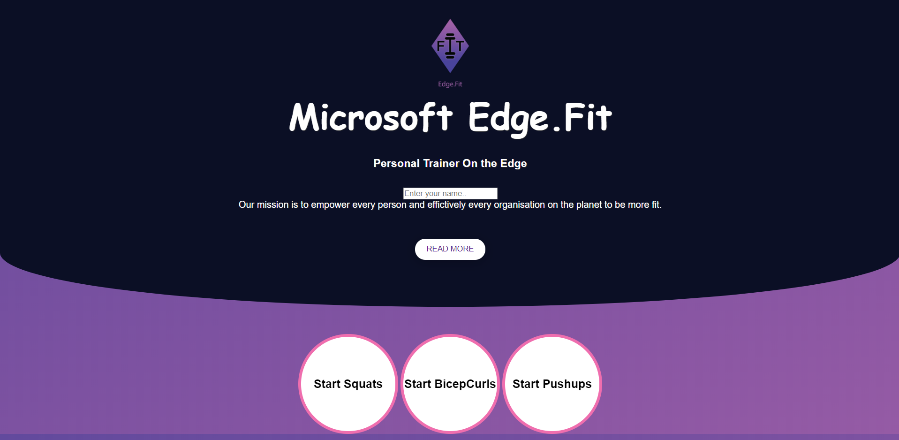

# Edge.Fit --- Intelligent Virtual Trainer
# Introduction

This project is a virtual trainer that can help you exercise correctly. It can detect your current posture by using the feed from the camera and then guide you with your selected exercise.

# Dependencies
* torch==0.4.1
* torchvision==0.2.1
* pycocotools==2.0.0
* opencv-python==3.4.0.14
* numpy==1.14.0
* flask
* socketio
* pyttsx3

# Running Edge.Fit
Run main.py to start the web app.
`python main.py`

Enter your name for the leaderboard and start the exercise by clicking on the appropriate button.

A window will pop up similar to the one below:

As you start doing the exercise, you will receive audio cues about your form. The virtual trainer will also count the number of repetitions.
